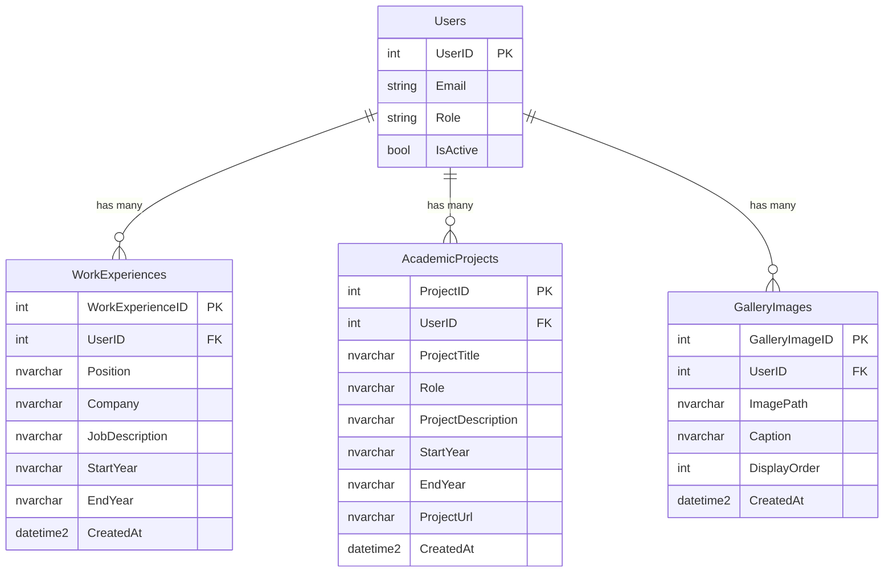

# 25 - Database Schema & Migration Guide: Work Experience, Academic Projects & Gallery

## Overview
This guide provides the complete database schema and step-by-step instructions for adding:
1. **Work Experience** (Company, Position, Job Description, Start Year, End Year)
2. **Academic Projects** (Project Title, Role, Description, Start Year, End Year, Project Link)
3. **Gallery** (Image carousel collection with Image Path, Caption, and Display Order)

The migration file is saved in:
[`Backend/Database/Migration/03_Add_WorkExperience_Projects_Gallery.sql`](file:///c:/Martin%20Archive/Programming/ASP%20NET/241611JalopPersonalWebsite/241611JalopPersonalWebsite/Backend/Database/Migration/03_Add_WorkExperience_Projects_Gallery.sql)

---

## 1. Relational Schema Architecture

All three tables follow the project's standard 1-to-many relationship with `dbo.Users`:
- `UserID` is a Foreign Key referencing `dbo.Users(UserID)` with `ON DELETE CASCADE`.
- Each table includes an index on `UserID` for fast indexed query lookups.
- Safe re-runnable (idempotent) syntax checking `IF OBJECT_ID(...) IS NULL`.



---

## 2. Table Specifications

### A. `dbo.WorkExperiences`
| Column | Type | Nullable | Description |
| :--- | :--- | :---: | :--- |
| `WorkExperienceID` | `INT IDENTITY(1,1)` | No (PK) | Primary unique identifier |
| `UserID` | `INT` | No (FK) | Reference to `dbo.Users(UserID)` |
| `Position` | `NVARCHAR(100)` | No | Job title / designation (e.g. *Junior Software Engineer*) |
| `Company` | `NVARCHAR(150)` | No | Company or employer name |
| `JobDescription` | `NVARCHAR(MAX)` | Yes | Responsibilities, achievements, and technologies |
| `StartYear` | `NVARCHAR(10)` | No | Year or period started (e.g. `2022`) |
| `EndYear` | `NVARCHAR(10)` | Yes | Year completed or `Present` for current roles |
| `CreatedAt` | `DATETIME2` | No | Timestamp of creation (defaults to `SYSUTCDATETIME()`) |

### B. `dbo.AcademicProjects`
| Column | Type | Nullable | Description |
| :--- | :--- | :---: | :--- |
| `ProjectID` | `INT IDENTITY(1,1)` | No (PK) | Primary unique identifier |
| `UserID` | `INT` | No (FK) | Reference to `dbo.Users(UserID)` |
| `ProjectTitle` | `NVARCHAR(150)` | No | Name or title of the academic project |
| `Role` | `NVARCHAR(100)` | No | Individual role (e.g. *Lead Developer*, *Fullstack Dev*) |
| `ProjectDescription` | `NVARCHAR(MAX)` | Yes | Summary of project objectives and tech stack |
| `StartYear` | `NVARCHAR(10)` | No | Year started (e.g. `2023`) |
| `EndYear` | `NVARCHAR(10)` | Yes | Year completed or `Present` |
| `ProjectUrl` | `NVARCHAR(500)` | Yes | Optional link to GitHub repository, live demo, or paper |
| `CreatedAt` | `DATETIME2` | No | Timestamp of creation (defaults to `SYSUTCDATETIME()`) |

### C. `dbo.GalleryImages` (Carousel)
| Column | Type | Nullable | Description |
| :--- | :--- | :---: | :--- |
| `GalleryImageID` | `INT IDENTITY(1,1)` | No (PK) | Primary unique identifier |
| `UserID` | `INT` | No (FK) | Reference to `dbo.Users(UserID)` |
| `ImagePath` | `NVARCHAR(500)` | No | Relative path or URL (e.g. `~/Uploads/Gallery/proj1.png`) |
| `Caption` | `NVARCHAR(255)` | Yes | Title, caption, or description overlay for the slide |
| `DisplayOrder` | `INT` | No | Sequence index (0, 1, 2...) for carousel ordering |
| `CreatedAt` | `DATETIME2` | No | Timestamp of creation (defaults to `SYSUTCDATETIME()`) |

---

## 3. How to Apply the Migration to Your Database

Choose any of the three methods below that matches your preferred workflow:

### Method 1: Using Visual Studio (Quickest & Built-In)
1. In Visual Studio, open **View** $\to$ **SQL Server Object Explorer** (or **Server Explorer**).
2. Right-click on your connected database (`db69719` or `IPTPersonalWebsite`) and choose **New Query**.
3. Open or copy the script from [`Backend/Database/Migration/03_Add_WorkExperience_Projects_Gallery.sql`](file:///c:/Martin%20Archive/Programming/ASP%20NET/241611JalopPersonalWebsite/241611JalopPersonalWebsite/Backend/Database/Migration/03_Add_WorkExperience_Projects_Gallery.sql).
4. Paste it into the query window and click the green **Execute** button (or press `Ctrl + Shift + E`).
5. Confirm in the Output window:
   - `Table dbo.WorkExperiences and index IX_WorkExperiences_UserID created successfully.`
   - `Table dbo.AcademicProjects and index IX_AcademicProjects_UserID created successfully.`
   - `Table dbo.GalleryImages and index IX_GalleryImages_UserID created successfully.`

---

### Method 2: Using SQL Server Management Studio (SSMS)
1. Open **SSMS** and connect to your database instance:
   - **For Remote Database**: `db69719.public.databaseasp.net` with user `db69719`.
   - **For Local Database**: `.` or `(localdb)\MSSQLLocalDB` using Windows Authentication.
2. Ensure you have the target database selected in the top-left dropdown (e.g., `db69719` or `IPTPersonalWebsite`).
3. Drag & drop [`03_Add_WorkExperience_Projects_Gallery.sql`](file:///c:/Martin%20Archive/Programming/ASP%20NET/241611JalopPersonalWebsite/241611JalopPersonalWebsite/Backend/Database/Migration/03_Add_WorkExperience_Projects_Gallery.sql) into SSMS.
4. Click **Execute** (or press `F5`).

---

### Method 3: Using Command Line (`sqlcmd`)

#### For Remote Hosted Database (`databaseasp.net`):
```powershell
sqlcmd -S "db69719.public.databaseasp.net" -d "db69719" -U "db69719" -P "aE#29sR_n!4C" -i "c:\Martin Archive\Programming\ASP NET\241611JalopPersonalWebsite\241611JalopPersonalWebsite\Backend\Database\Migration\03_Add_WorkExperience_Projects_Gallery.sql"
```

#### For Local Database (`IPTPersonalWebsite`):
```powershell
sqlcmd -S "." -d "IPTPersonalWebsite" -E -i "c:\Martin Archive\Programming\ASP NET\241611JalopPersonalWebsite\241611JalopPersonalWebsite\Backend\Database\Migration\03_Add_WorkExperience_Projects_Gallery.sql"
```
